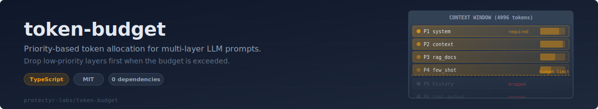
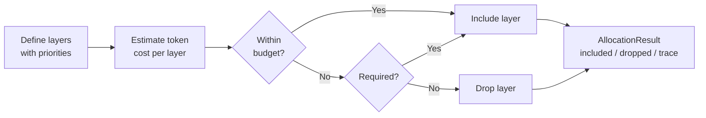

<p align="center">
  
</p>

<p align="center">
  <a href="https://github.com/protectyr-labs/token-budget/actions/workflows/ci.yml"></a>
  <a href="./LICENSE"></a>
  <a href="https://www.typescriptlang.org/"></a>
  <a href="#"></a>
</p>

---

If you are building multi-layer LLM prompts -- system instructions, RAG documents, chat history, few-shot examples, tool schemas -- you have a real problem: the combined context regularly exceeds the model's effective window, and the standard fix (truncate everything proportionally) destroys the layers that matter most. `token-budget` solves this by letting you assign priorities to each layer and dropping the lowest-priority content first when the budget is exceeded. Required layers are never dropped. The allocation trace tells you exactly what was included and what was shed, so debugging "why did the model ignore my retrieval results?" becomes a one-line check.

## Quick Start

```bash
npm install github:protectyr-labs/token-budget
```

```typescript
import { createBudget, allocate } from '@protectyr-labs/token-budget';

const budget = createBudget(500, [
  { name: 'system',   priority: 1, required: true },
  { name: 'context',  priority: 2 },
  { name: 'history',  priority: 3 },
  { name: 'docs',     priority: 4 },
]);

const result = allocate(budget, {
  system:  'You are a helpful assistant...',   // 29 tokens
  context: 'User works at Acme Corp...',       // 125 tokens
  history: chatMessages,                        // 335 tokens -- dropped
  docs:    retrievedChunks,                     // 93 tokens
});

// result.included => ['system', 'context', 'docs']
// result.dropped  => ['history']
// result.totalTokens => 379
```

## Why This?

- **Priority-based dropping** -- full context or none, not truncated everything
- **Required layers never dropped** -- system prompt always fits
- **4-char/token estimator** -- within 10% of tiktoken, zero dependencies
- **Custom estimator support** -- swap in tiktoken when you need precision
- **Per-layer caps** -- `maxTokens` prevents any single layer from dominating

## Architecture



> [!NOTE]
> Layers are processed in priority order (lowest number first). Once the running total exceeds the budget, all remaining non-required layers are dropped. Required layers are always included even if they push the total over the limit.

## API

| Function | Description |
|----------|-------------|
| `createBudget(totalTokens, layers, options?)` | Define budget with prioritized layers |
| `allocate(budget, contents)` | Fit content into budget; returns included/dropped/tokens |
| `estimateTokens(text)` | ~4 chars/token estimate (English) |

### Layer Config

- `name` -- layer identifier
- `priority` -- lower number = higher priority (1 is highest)
- `required` -- never dropped regardless of budget
- `maxTokens` -- cap this layer's contribution

## Use Cases

**RAG pipelines** -- System prompt + retrieved documents + user query. Documents are variable-length. Token budget ensures the system prompt is never dropped, documents get priority 2, and chat history is shed first.

**Multi-turn chat** -- As conversation grows, old messages push you over the context limit. Token budget drops the oldest messages while keeping the system prompt and last few turns.

**Agent tool results** -- An agent calls 5 tools. Their combined output exceeds the context window. Token budget keeps the task description and drops the least-relevant tool results.

## Design Decisions

These are the key architectural choices and their rationale. See [`ARCHITECTURE.md`](./ARCHITECTURE.md) for the full decision record.

| Decision | Rationale |
|----------|-----------|
| Estimate tokens (4 chars/token) instead of exact counting | tiktoken adds a dependency, takes ~50ms per call, and is model-specific. The 4:1 ratio is within 10% for English. For budget enforcement (not billing), that accuracy is sufficient. |
| Drop entire layers rather than truncating proportionally | A complete context layer is more useful than a truncated one. 100% system + 0% history beats 80% of each. |
| Required layers cannot be dropped | The system prompt defines model behavior. Dropping it produces unpredictable results. Better to go slightly over budget. |
| Allocation trace is always returned | When debugging "why did the model miss context X?", the included/dropped arrays answer immediately. No separate trace mode needed. |

## Limitations

- **English-optimized** -- CJK languages average ~2 chars/token, not 4
- **All-or-nothing per layer** -- no partial truncation within a layer
- **No model-specific budgets** -- you provide the token limit

## See Also

- [prompt-shield](https://github.com/protectyr-labs/prompt-shield) -- scan untrusted text before it enters your prompt
- [file-preprocess](https://github.com/protectyr-labs/file-preprocess) -- extract text from files for LLM context
- [vector-dedup](https://github.com/protectyr-labs/vector-dedup) -- deduplicate context chunks before budgeting

## Origin

Extracted from the enrichment pipeline of [OTP2](https://github.com/protectyr-labs), where 5 context layers compete for a single model's context window during cybersecurity assessments. Built to be reusable across any LLM application that assembles prompts from multiple sources.

## License

MIT
